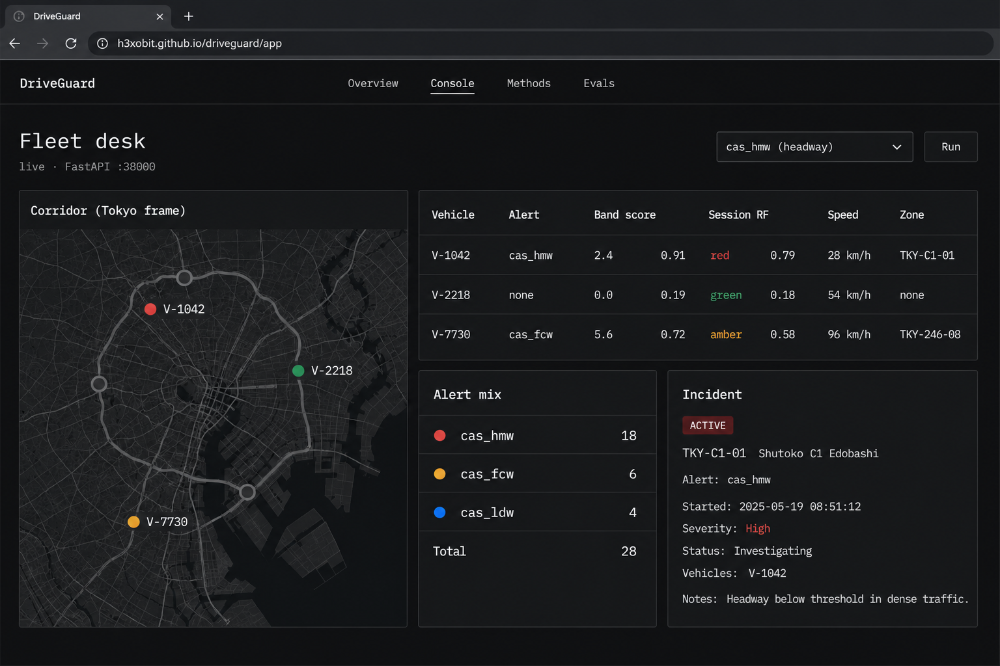
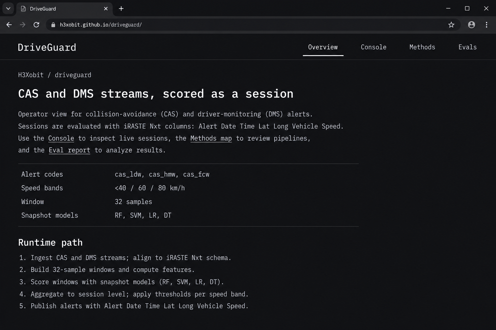
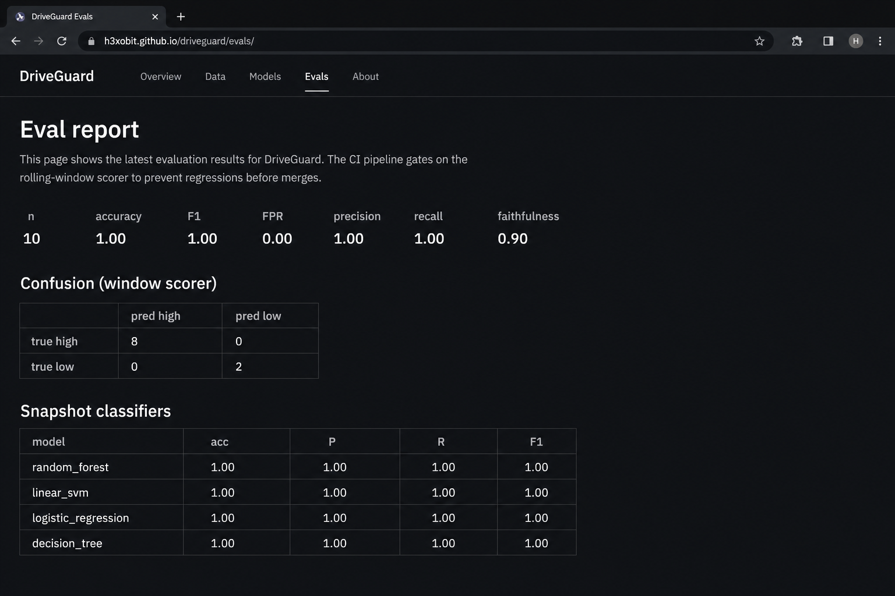

# DriveGuard

Operator console for collision-avoidance (CAS) and driver-monitoring (DMS) alerts.

DriveGuard scores a driving session as it arrives, not a single CSV row. Each sample carries speed, brake, steering, GPS, and an iRASTE-style alert code (`cas_ldw`, `cas_hmw`, `cas_fcw`, `dms_distract`). A 32-step window produces a session risk score. Mapped crash corridors add a zone term. Fault events hide informational chatter so the desk sees what to act on.

Site: **https://h3xobit.github.io/driveguard/**

## Fleet desk



Vehicles, CAS/DMS codes, speed-band scores, session risk, and the Tokyo corridor map on one page. Inject `cas_hmw`, `cas_fcw`, `cas_ldw`, or `dms_distract` against a live API, or read the static snapshot on Pages.

## Overview and eval report





## What it does

1. A simulator emits telemetry in the usual iRASTE Nxt column set: Alert, Date, Time, Lat, Long, Vehicle, Speed.
2. Each alert gets a speed-band score. Band 1 is below 40 km/h, band 2 is 40-60, band 3 is 60-80, band 4 is 80+. Speeds above 60 km/h step up. Weights follow FCW > HMW > LDW.
3. A 32-step window is scored with an interpretable heuristic blended with a small numpy GRU, compared with a Random Forest baseline.
4. GPS is checked against three Tokyo corridors (Shutoko C1, Route 246, Shutoko K3). Live kinematics inside a hotspot is one ticket, not two.
5. Incident notes retrieve guideline chunks only. Weather and biometrics are out of scope.
6. CI reports accuracy, FPR, F1, a confusion matrix, and four snapshot classifiers (RF, linear SVM, logistic regression, decision tree). Those four are a baseline table, not the live path.

## Schema

| Field | Meaning |
| --- | --- |
| Alert | `cas_ldw`, `cas_hmw`, `cas_fcw`, `dms_distract` |
| Date / Time | sample timestamp (UTC) |
| Lat / Long | WGS84 |
| Vehicle | fleet id (`V-1042` and siblings in the demo) |
| Speed | km/h, also the input to the band score |

## Stack

- Python 3.11, FastAPI, numpy, scikit-learn
- Optional PyTorch LSTM (`pip install -e ".[torch]"`)
- Next.js 14 operator UI
- Postgres + MQTT in compose (the API still runs without them for tests)
- GitHub Actions for unit tests, the eval gate, and Pages

## Run

```bash
python3 -m pip install -e ".[dev]"
pytest -q
python -m driveguard.eval_harness --smoke 10
make demo
```

UI: http://localhost:33000  
API: http://localhost:38000/docs

Keys stay in a local `.env` that is not committed. Copy `.env.example` if you want a live LLM path. Default is `DG_OFFLINE_LLM=1`.

## Ports

| Service | Host port |
| --- | --- |
| API | 38000 |
| Web | 33000 |
| Postgres | 35432 |
| MQTT | 31883 |

## Out of scope

Bulk CAS CSV ingest, PostGIS `ST_DWithin` (issue #1), a trained Temporal Fusion Transformer, biometrics, and weather.

## License

MIT
